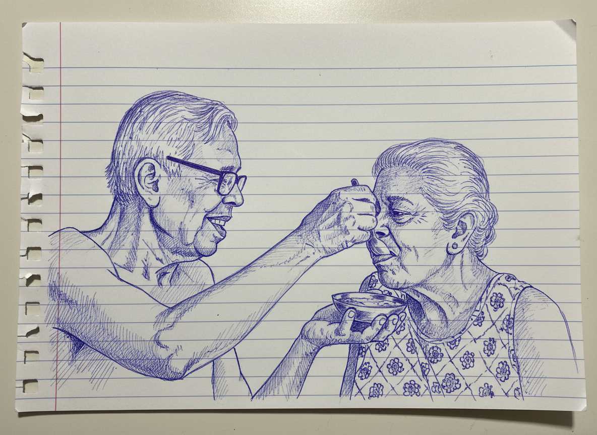
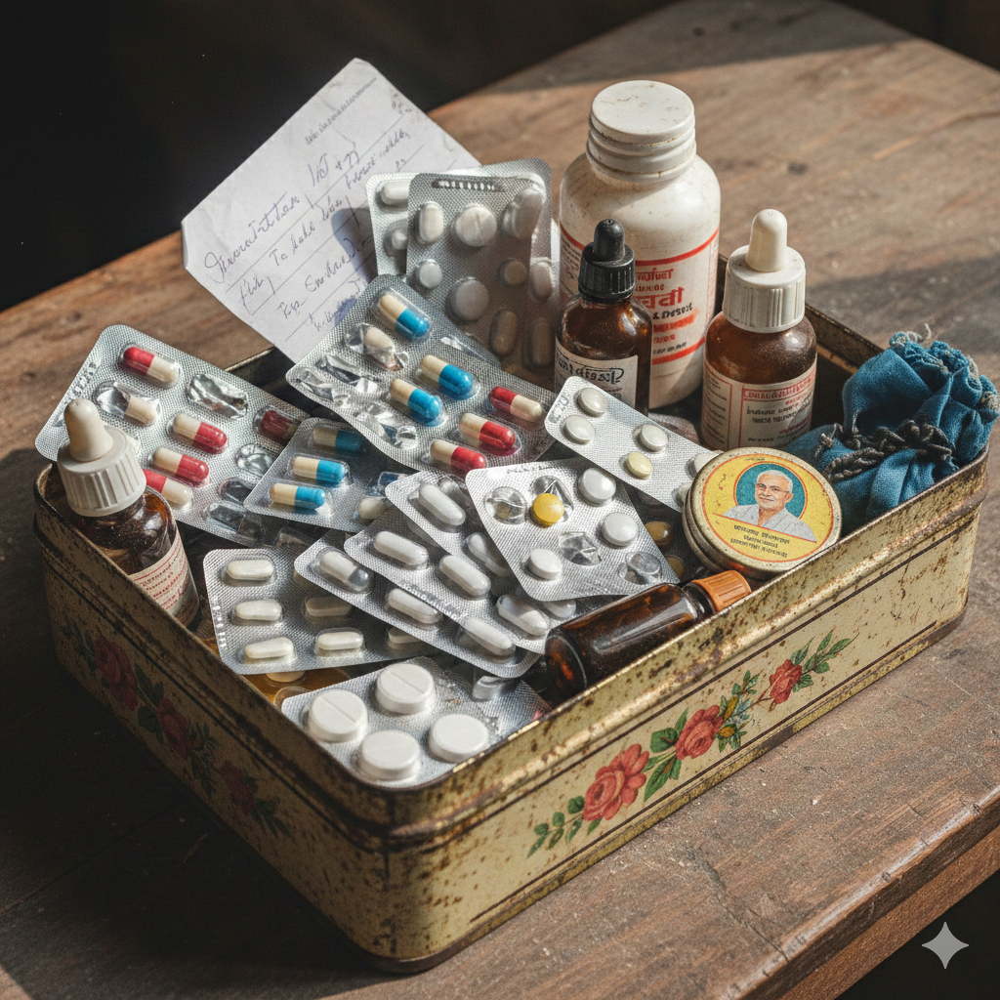
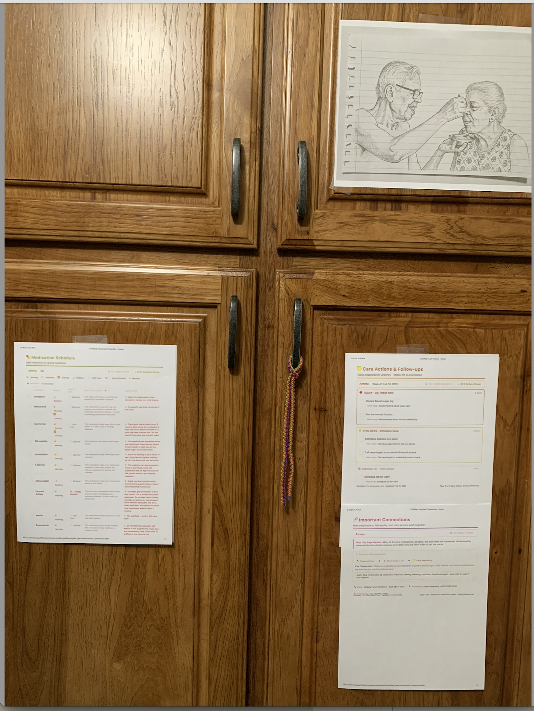

# CareMap

**One model, three modules, maximum impact on both sides of healthcare.**

<p align="center">
  
</p>

<p align="center"><em>Bapi feeding Ma. CareMap was built in her honor.</em></p>

CareMap uses **MedGemma 1.5 4B-IT** to serve both patients and providers - transforming complex health data into plain-language fridge sheets for caregivers, and triaging radiology and lab queues for clinicians.

Built for the [Kaggle MedGemma Impact Challenge](https://www.kaggle.com/competitions/med-gemma-impact-challenge).

<p align="center">
  <a href="https://www.youtube.com/watch?v=iCwVuBD-tv8">📺 Video Demo</a> &nbsp;|&nbsp;
  <a href="https://huggingface.co/spaces/rgiri2025/caremap-medgemma">🤗 HuggingFace Space</a> &nbsp;|&nbsp;
  <a href="https://www.kaggle.com/code/codekunoichi/caremap-medgemma-competition-v8">📓 Kaggle Notebook</a>
</p>

```
                          CareMap
                            |
            +---------------+---------------+
            |               |               |
      Fridge Sheet    Radiology Triage   HL7 Triage
      (Patient Side)  (Provider Side)    (Provider Side)
      Text Reasoning  Multimodal         Text Reasoning
            |               |               |
    +-------+-------+  MedGemma 1.5    MedGemma 1.5
    |   |   |   |   |  finds findings   triages labs
   Meds Labs Gaps Img      |               |
    |   |   |   |   |  Rule Engine      Priority
    v   v   v   v   v  (CSV-auditable)  Classification
  5 Printable Pages     |               |
    8.5 x 11"      STAT/SOON/ROUTINE  STAT/SOON/ROUTINE
        |
   NLLB-200 Translation (600+ languages)
```

---

## The Problem

<p align="center">
  
</p>

<p align="center"><em>A typical medicine box. Dozens of pills, handwritten notes, no clear instructions. The Ayah changes every week - how do you hand off care?</em></p>

---

## Three Modules

### Module 1: Fridge Sheet Generator (Patient Side)

MedGemma interprets medications, labs, care gaps, and imaging reports into plain language at a 6th-grade reading level. Output: **five printable 8.5x11" pages** designed for the kitchen wall.

| Page | Content | Audience |
|------|---------|----------|
| 1 | Medication schedule with time/food badges | Caregiver |
| 2 | Lab results in plain language | Family |
| 3 | Care actions: Today / This Week / Later | Family |
| 4 | Imaging findings explained simply | Family |
| 5 | How meds, labs, and actions connect | Both |

Multilingual translation via **NLLB-200** (600+ languages) supports Bengali, Hindi, Spanish, Farsi, Turkish, Chinese, and many more - preserving medication names and doses as safety-critical untranslated elements.

### Module 2: Radiology Triage (Provider Side)

MedGemma's multimodal capability analyzes chest X-rays and detects findings. A **physician-auditable rule engine** (single CSV file) maps findings to priority levels.

```
MedGemma (multimodal) --> findings list
        |
Rule Engine (CSV) --> rule_priority
        |
Final = max(model, rules)    <-- only escalates, never downgrades
        |
"No Finding" --> force ROUTINE
```

Result: **100% STAT recall** (3/3) on evaluation set.

### Module 3: HL7 Message Triage (Provider Side)

MedGemma triages incoming HL7 ORU lab results by urgency -surfacing critical values (Troponin elevation, dangerous potassium) above routine results.

Result: **85% accuracy** on 20-message evaluation set.

### The Deliverable: On the Fridge

<p align="center">
  
</p>

<p align="center"><em>The actual deliverable. Printed. On the fridge. The Ayah walks in Monday morning, the sheet is right there. Zero technology required.</em></p>

---

## Architecture

```
src/caremap/
  |
  |-- llm_client.py            MedGemma client (v1 + v1.5), auto device/dtype
  |-- medication_interpretation.py   Medication --> plain language
  |-- lab_interpretation.py          Lab results --> plain language
  |-- caregap_interpretation.py      Care gaps --> action items
  |-- imaging_interpretation.py      Imaging reports --> plain language
  |-- assemble_fridge_sheet.py       Orchestrator (all 4 interpreters)
  |-- fridge_sheet_html.py           JSON --> 5 printable HTML pages
  |-- radiology_triage.py            X-ray triage (STAT/SOON/ROUTINE)
  |-- priority_rules.py              CSV-based rule engine for radiology
  |-- hl7_triage.py                  HL7 ORU message triage
  |-- translation.py                 NLLB-200 with back-translation validation
  |-- html_translator.py             DOM-based HTML translation (lxml)
  |-- validators.py                  JSON extraction, schema validation
  |-- safety_validator.py            Forbidden terms, jargon detection
  |-- prompt_loader.py               Template loading (prompts/)

prompts/                    Task-scoped prompt templates (V1, V2, V3)
examples/                   Sample patient data + golden test specs
data/nih_chest_xray/        NIH demo images + priority rules CSV
tests/                      231 unit tests (mocked MedGemma)
tests/integration/          Golden tests (real MedGemma, slow)
notebooks/                  Kaggle + local notebooks
huggingface_space/          Gradio demo (standalone copy)
```

---

## Quickstart

### Prerequisites

- Python 3.10+
- [HuggingFace account](https://huggingface.co) with MedGemma license accepted
- GPU recommended (T4 16GB for full pipeline; MPS on Apple Silicon for development)

### Setup

```bash
# Create and activate virtual environment
python3 -m venv .venv
source .venv/bin/activate

# Install dependencies
pip install -r requirements.txt

# Log in to HuggingFace (one time)
huggingface-cli login

# Accept the MedGemma license at:
# https://huggingface.co/google/medgemma-1.5-4b-it
```

### Run Tests

```bash
# All unit tests (fast, mocked MedGemma)
PYTHONPATH=src pytest tests/ --ignore=tests/integration/

# Single test file
PYTHONPATH=src pytest tests/test_priority_rules.py -v

# Integration tests (requires real MedGemma model)
PYTHONPATH=src pytest tests/integration/ -v
```

### Run a Module

```bash
# Medication interpretation demo
PYTHONPATH=src python -m caremap.medication_interpretation

# Build Kaggle dataset zip
./build_kaggle_dataset.sh
```

---

## Kaggle Setup Guide

### Step 1: Build the Dataset Zip

```bash
./build_kaggle_dataset.sh
# Output: kaggle_dataset/caremap-medgemma-dataset.zip (~10MB, ~77 files)
```

### Step 2: Upload as a Kaggle Dataset

1. Go to [kaggle.com/datasets](https://www.kaggle.com/datasets) → **New Dataset**
2. Upload `kaggle_dataset/caremap-medgemma-dataset.zip`
3. Name it **`caremap-medgemma`** (the notebook expects this exact name)
4. Set visibility to **Public** → **Create**

### Step 3: Create the Kaggle Notebook

1. Go to [kaggle.com/code](https://www.kaggle.com/code) → **New Notebook**
2. Upload `notebooks/caremap_kaggle_submission.ipynb`
3. Under **Add-ons → Datasets**, search for `caremap-medgemma` and attach it
4. Under **Add-ons → Secrets**, add secret: key = `HUGGINGFACE_TOKEN`, value = your HF token
   - Requires MedGemma license accepted at [huggingface.co/google/medgemma-1.5-4b-it](https://huggingface.co/google/medgemma-1.5-4b-it)
5. Under **Settings**, set Accelerator to **GPU T4 x1**
6. **Run All** — full notebook takes ~41 minutes on T4 (~29 min for evaluation cells)

### Step 4: Make Notebook Public

Settings → Sharing → **Public** — required for competition submission.

> **GPU budget note:** Full notebook run (all cells) takes ~41 minutes on T4 — ~29 min for the evaluation section alone. Plan accordingly against the 30hr/week Kaggle GPU quota.

---

## Evaluation Results (Kaggle T4 GPU)

Proof-of-architecture validation across 64 MedGemma inference calls (~29 min on T4):

| Module | N | Primary Metric | Score |
|--------|---|----------------|-------|
| Radiology Triage | 26 chest X-rays | STAT Recall | **100%** (3/3) |
| Radiology Triage | 26 chest X-rays | Overall Accuracy | 50% |
| HL7 Triage | 20 ORU messages | STAT Recall | **100%** |
| HL7 Triage | 20 ORU messages | Overall Accuracy | **80%** |
| Medication Interp. | 10 medications | Safety Pass Rate | **90%** |
| Lab Interp. | 8 golden scenarios | No Forbidden Terms | **88%** |

Radiology over-triage is deliberate -a false STAT is an inconvenience; a missed STAT is a death.

---

## Safety by Design

CareMap **never** diagnoses, recommends treatment, or displays raw lab values. It fails closed - omitting information rather than speculating. Emergency contacts are data-driven from the patient JSON, never model-generated.

See [`SAFETY_AND_LIMITATIONS.md`](SAFETY_AND_LIMITATIONS.md) for full details.

---

## Deployments

| Platform | Purpose | Link |
|----------|---------|------|
| **Kaggle Notebook** | Competition deliverable (end-to-end) | [caremap-medgemma-competition-v8](https://www.kaggle.com/code/codekunoichi/caremap-medgemma-competition-v8) |
| **HuggingFace Spaces** | Interactive Gradio demo | [rgiri2025/caremap-medgemma](https://huggingface.co/spaces/rgiri2025/caremap-medgemma) |
| **Video Demo** | Competition video walkthrough | [YouTube](https://www.youtube.com/watch?v=iCwVuBD-tv8) |
| **Printable HTML** | The actual caregiver deliverable | No app, no internet - works on any printer |

---

## Key Documentation

| File | Purpose |
|------|---------|
| [`WRITEUP.md`](WRITEUP.md) | Competition writeup |
| [`SAFETY_AND_LIMITATIONS.md`](SAFETY_AND_LIMITATIONS.md) | Non-goals and safeguards |
| [`CANONICAL_SCHEMA.md`](CANONICAL_SCHEMA.md) | v1.1 EHR input schema |
| [`FRIDGE_SHEET_SCHEMA.md`](FRIDGE_SHEET_SCHEMA.md) | Output schema (locked) |
| [`INPUT_OUTPUT_RULES.md`](INPUT_OUTPUT_RULES.md) | Deterministic transformation rules |
| [`CHANGELOG.md`](CHANGELOG.md) | All notable changes |

---

## Acknowledgements

**Family.** My father, whose insights shaped the concept. My mother, whose encouragement to keep moving forward lives on in this work.

**User Research Partners.** [Dr. Vinodhini Sriram](https://www.pihhealth.org/find-a-doctor/physician-profile-advanced/vinodhini-sriram/) (Family Medicine, US), [Dr. Gaurav Mishra](https://www.linkedin.com/in/gaurav-mishra-md-mba-dfapa-99213a5/) (Psychiatrist, US), Dr. Manini Moudgal (Pediatrician, India), [Sunayana Mann](https://www.linkedin.com/in/sunayana-mann/) (Digital Health & Caregiver, US).

**LLM Council.** Claude (Anthropic), ChatGPT (OpenAI), Gemini (Google) - thought partners, devil's advocates, and research aids. **Claude Code** - for orchestrating the implementation and making a solo developer brave enough to attempt this competition.

**Kaggle & Google.** For hosting the MedGemma Impact Challenge and the opportunity to learn MedGemma by building with it.

---

## License

Apache License 2.0

---

CareMap is built with the belief that **clarity is care**.
